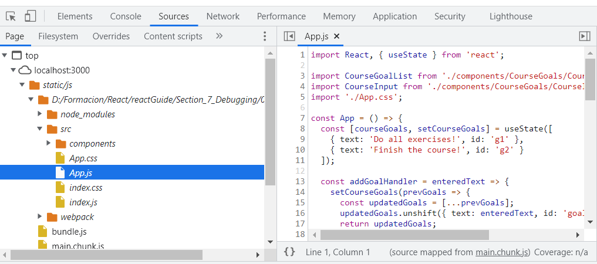
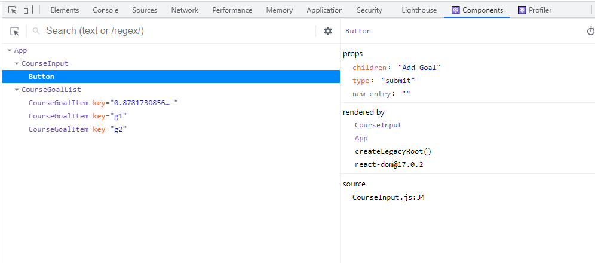

# Debug

## Errors

> 01-starting-project\src\App.js: Adjacent JSX elements must be wrapped in an enclosing tag. Did you want a JSX fragment <>...</>? (43:6)

Only one root element

> App.js Line 41:33:  'addGoalsHandler' is not defined  no-undef

Typo or non existing function

> Nothing was returned from render. This usually means a return statement is missing

Return or parentheses missing in a JSX _component_

> Uncaught Error: Too many re-renders. React limits the number of renders to prevent an infinite loop.

Loop of component evaluation. UseEffects

## Warnings

Some errors doesn't appear as compilation error, only as warning, but it can affect. For example, if we add all list elements with the same id, we will get unexpected behaviours.

> index.js:1 Warning: Encountered two children with the same key, `goal1`. Keys should be unique so that components maintain their identity across updates. Non-unique keys may cause children to be duplicated and/or omitted — the behavior is unsupported and could change in a future version.

## Using debugger

Development server shows the development code as is and enable debug in the browser.

## React Developer Tools

More features to debug, two new tabs in inspect view, with info about the internal state

* Components
  * Componet tree with values, functions, state and props.
  * Profiler
