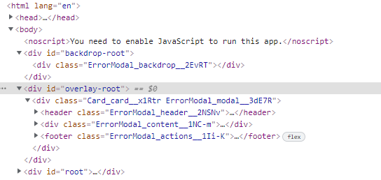

# Fragments & Portals & Refs

JSX can have only one root element, and to solve the problem, sometimes we use a wrapper or embed the code in a simple div. There is another solution, convert the elements in an array, removinf curly brackets and separating elements with commas, but it requires to add a _key_ as _prop_ beacuse React want keys to paint lists.

```js
    [error && (
        <ErrorModal key='error-modal'
          title={error.title}
          message={error.message}
          onConfirm={errorHandler}
        />
      ),
      <Card key='users-list' className={classes.input}>
        <form onSubmit={addUserHandler}>
          <label htmlFor="username">Username</label>
          ...
       </Card>
    ]     
```

This is an ugly solution, but adding a _div_ it is not better, because we are adding unnecessary elements that in big projects can be a performance problem in browsers, and generates a ,ore difficult code to read.

## Wrapper

We can do a real empty wrapper, without css. No react imports, because it not returns JSX

```js
const Wrapper = (props) => {
    return props.children;
}

export default Wrapper;
```

We can use this instead the wrapper _div_

## Fragment

React has its own wrapper, we can call it in two ways

* <></>
* <React.Fragment></React.Fragment>
  * If we import Fragment from react
    * import {Fragment} from 'react'
    * \<Fragment>\</Fragment>

## Portals

In this project, we put a modal besides the addUser component, it works, but it is not a clean HTML code, because modal is at the layer top, it must overlay all other components, and the code would be better not nested.

Portals needs

* A code to transport
* A place to transport

We are going to divide the modal in two _components_, they can be in the same file or not.

```js
const Backdrop = (props) => {
  return <div className={classes.backdrop} onClick={props.onConfirm} />;
}

const OverlayModal = props => {
   
      return <Card className={classes.modal}>
        <header className={classes.header}>
        ...
      </Card>;
}
```

And this two components are transported by react-dom dependency

```js
import ReactDOM from 'react-dom';

...

return (
    <>
      {ReactDOM.createPortal(
        <Backdrop onClick={props.onConfirm} />,
        document.getElementById("backdrop-root")
      )}
      {ReactDOM.createPortal(
        <ModalOverlay
          onConfirm={props.onConfirm}
          message={props.message}
          title={props.title}
        />,
        document.getElementById("overlay-root")
      )}
      ;
    </>
  );

```

The final place is in _index.html_

```html
  <body>
    <noscript>You need to enable JavaScript to run this app.</noscript>
    <div id="backdrop-root"></div>
    <div id="overlay-root"></div>
    <div id="root"></div>
    <!--
```



## Refs

When we want to read a value from an input, we have to create a method to read the value an _useState_ to maintain and use it

* Import hook _useRef_
* _useRef()_ creates a connector with HTML
* Assign the connector ref to attribute _key_ in any HTML element  you want
* Read the value from _current_ children of _useRef()_ connector
  * nameInputRef.current.value
* No _state_, _handler_ or HTML _value_ attribute are required to read
* This is only for read, then we lost write capability for reset form. If we need reset we can use the _state_ strategy
  * As an exception, we can change the node value without use react
    * nameInputRef.current.value = '';
* _Uncontrolled components_ because React doesn't control the element state
* `Components` __don't admit ref__, only HTML tags

```js
const AddUser = (props) => {
  const [enteredUsername, setEnteredUsername] = useState('');
  const [enteredAge, setEnteredAge] = useState('');
  const [error, setError] = useState();

  const addUserHandler = (event) => {
    event.preventDefault();
    if (enteredUsername.trim().length === 0 || enteredAge.trim().length === 0) {
      setError({
        title: 'Invalid input',
    ...}
    }
   }

const usernameChangeHandler = (event) => {
    setEnteredUsername(event.target.value);
  };

```

With hook _useRef_ we can connect any HTML node with javascript element through React, to read the values.

> import React, { useState, useRef } from 'react';

```js
const AddUser = (props) => {

  const nameInputRef = useRef();
  const ageInputRef = useRef();

  /*const usernameChangeHandler = (event) => {~~
    setEnteredUsername(event.target.value);
  };*/
  ...

    <input
            id="username"
            type="text"
            //value={enteredUsername}
            //onChange={usernameChangeHandler}
            ref={nameInputRef}
          />
```

To connect we only need to create a ref to the DOM element with _useRef_ and assign the value to the _key_ attribute in the HTML.

No _states_, _handlers_ or _values_ attributes are required to read from HTML element.

To write data as in the reset form, it is not recomended but we can use

```js
    //setEnteredUsername('');
    //setEnteredAge('');
    nameInputRef.current.value = '';
    ageInputRef.current.value = '';
```
