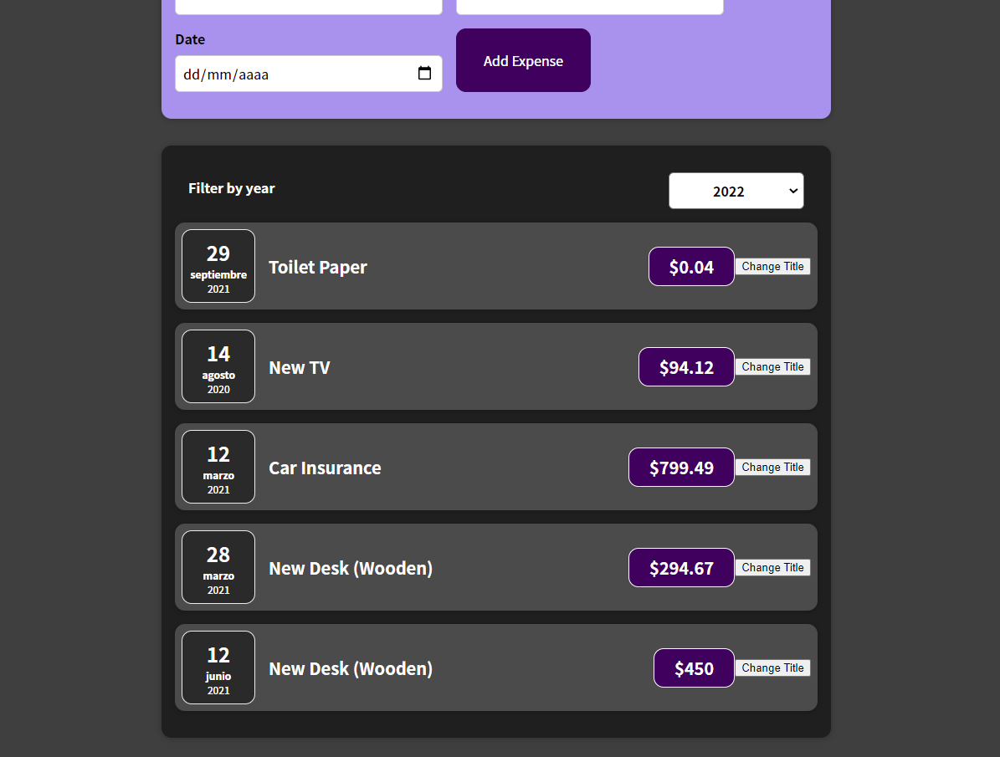

# List & Conditional

## Dynamic expressions. Javascript expressions

We can call javascript functions inside attributes on JSX structures, but we can call javascript that returns JSX structures too.

> { [\<Card />, \<Card />]

This array can be translated in two JSX components, and we can call a javascript function that returns an array of JSX.

Then we can create a list of elements with a javascript function

```js
 <Card className="expenses">
      <div><ExpensesFilter selected={filteredYear} onChangeFilter={filterChangeHandler} /></div>
        {props.items.map((expense) => (
                <ExpenseItem
                title={expense.title}
                amount={expense.amount}
                date={expense.date}
                ></ExpenseItem>
            ))}
```

Instead of

```js
 <Card className="expenses">
      <div><ExpensesFilter selected={filteredYear} onChangeFilter={filterChangeHandler} /></div>
      <ExpenseItem
        key={expense.id}
        title={props.items[0].title}
        amount={props.items[0].amount}
        date={props.items[0].date}
      ></ExpenseItem>
      <ExpenseItem
        ...
      ></ExpenseItem>
      <ExpenseItem>...
```

To the previous ExpenseItem data, we have to add another one, _key_

Without it, the browser refreshes the list but can override elements instead of repaint all the list, with bugs like this



New elements are have the first original title, and the old one show __New Desk (Wooden)__

In this case, our elements has their own id, but if they haven't, some javascript methods can get the array index, but it only removes React warning, for me in this case, the bug continues.

```js
    {props.items.map((expense, index) => (
                <ExpenseItem
                //key={Math.random().toString()}
                key={index}
                title={expense.title}
```

To add new elements to the list, _useState_ is used again, with previous state update strategy.

```js
function App() {
 
  const [expenses, setExpenses] = useState (DUMMY_EXPENSES);

  const addExpenseHandler = expense => {
    setExpenses((prevExpenses) => {
      return [expense, ...prevExpenses];
    });
  }
```
