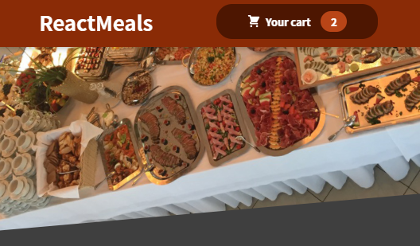
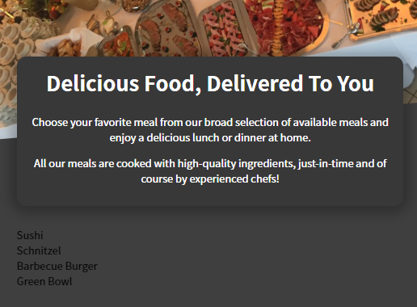
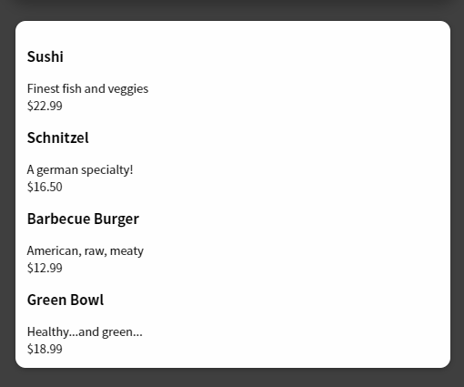
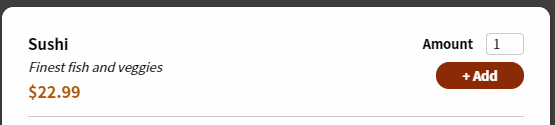
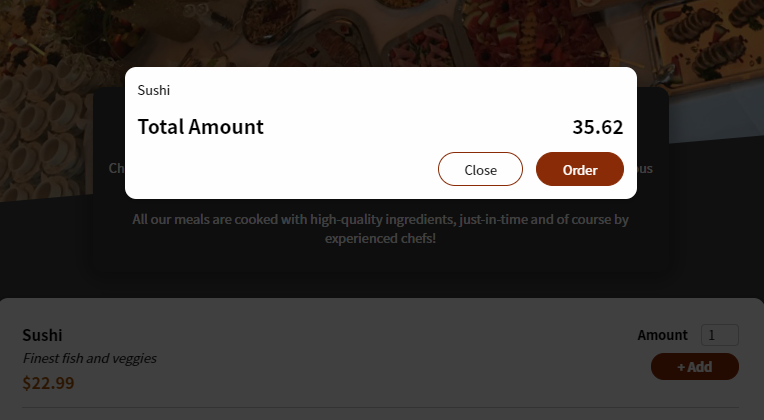

# Practice User Project

App to order food, with editable shopping cart

## Code

1. [Snapshots project](https://github.com/academind/react-complete-guide-code/tree/11-practice-food-order-app)

## Steps

(e) extra files

1. `Create Header`
   1. Layout/Header
      1. Header.module.css (e)
   2. . assets/meals.jpg (e)
2. `Add header cart button`
   1. Layout/HeaderCartButton
      1. HeaderCartButton.module.css (e)
   2. Cart/CartIcon (e)
   3. [Step 2](#Step-2)
3. `Meal summary and available meals`
   1. Meals/Meals
   2. AvailableMeals
      1. dummy-meals.js (e)
   3. Meals/MealsSummary (e)
      1. MealsSummary.module.css (e)
   4. [Step 3](#Step-3)
4. `Format Available meals`
   1. UI/Card
      1. Card.module.css (e)
   2. Meals/MealItem/MealItem
      1. MealItem.module.css (e)
   3. Show AvailableMeals with MealItem
   4. [Step 4](#Step-4)
5. `Add form button to add meal`
   1. Meals/MealItem/MealItemForm
      1. MealItemForm.module.css (e)
   2. UI/Input
      1. Input.module.css (e)
   3. [Step 5](#Step-5)
6. `Cart`
   1. Cart/Cart
   2. This element is rendered in a modal
7. `Add modal`
   1. Create a div to contain modal in _index.html_ __Portal__
      1. \

   2. UI/Modal
      1. component BackDrop
      2. component Overlay
      3. Modal.module.css (e)
   3. Cart/Cart
      1. Replace wrapper _div_ by `Modal`
      2. Place Cart in another _component_
         1. App.js
      3. Cart.module.css (e)
      4. Portal to place the modal components
         1. ReactDOM.createPortal(\<Backdrop />, overlays )
      5. [Step 6](#Step-6)
8. `Functional Modal`
   1. _state_ at App to hide/show `Cart`
   2. `showModalHandler`function to `HeaderCartButton`
   3. `showModalHandler`function to
      1. `Backdrop`
      2. `Cart.Modal.button`
   4. Don't use `Context`becasue a modal can be used multiple times
9. `Prepare Context  for Add/remove/check cart items`
   1. This can be done from several places `AvailableMeals` and `Cart`, better use `Context`
   2. `Context` will have __itemsList, totalAmount, addItemFn, removeItemFn__
   3. store/cart-context
   4. store/CartProvider
      1. All the logic relative to `Cart`
   5. `Context` will be used from Modal, HeaderCartButton and AvailableMeals
   6. `App` is a good place to embed `CartProvider` instead a void `Fragment`
   7. To initiate the context, we start the value from our `CartProvider`
      1. \<CartContext.Provider value={cartContext} >{props.children}</CartContext.Provider>
10. `Check cart items`
    1. To access `Context` the data from `HeaderCartButton`
    2. `useContext(CartContext)`
          1. > import CartContext from '../../store/cart-context';
11. `Add item`
    1. `useReducer` to control the state in `CartProvider`
       1. > const [cartState, dispatchCartAction] = useReducer(cartReducer, defaultCartState)
          1. `dispatchCartAction` executes `cartReducer` with safety
          2. `defaultCartState` initial value
          3. `cartState` last updated state
    2. Add a call in MealItemForm `submitHandler` to enable action
       1. `useRef` to connect form element
          1. `Input`is a custom component, we have to use `useRef`
          2. amountInputRef.current.value to read the `Input` value
          3. `useState` to control form validation
    3. Add element to `Context` in `MealItem` 
       1. Pass a prop method `addToCartHandler`
       2. `MealItemForm` executes `addToCartHandler` 

### Step 2

### Step 3

### Step 4

### Step 5

### Step 6

